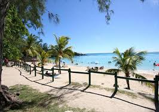

<!DOCTYPE html>
<html lang="en">
<head>
    <meta charset="UTF-8">
    <meta name="viewport" content="width=device-width, initial-scale=1.0">
    <title>Travel Recommendations</title>
    
</head>
<body>

    <nav>
        <ul>
            <li><a href="#">Home</a></li>
            <li><a href="#">About Us</a></li>
            <li><a href="#">Contact Us</a></li>
            <li><a href="#">Beaches</a></li>
            <li><a href="#">Temples</a></li>
            <li><a href="#">Countries</a></li>
        </ul>
    </nav>

    <header>
        <h1>Welcome to Travel Recommendations</h1>
        
Your ultimate guide to discovering the best travel destinations based on your preferences.

    </header>

    <section>
        <h2>About Us</h2>
        
At our core, we’re on a mission to transform every journey into a personalized adventure. Whether you’re dreaming of unwinding on sun-kissed beaches, stepping back in time to explore ancient temples, or immersing yourself in the rich history and culture of a new destination, we’ve got you covered.

        
Our team is a vibrant group of travel aficionados, united by a shared passion for discovery and adventure. With our expertise and dedication, we’ll make sure your next trip isn’t just memorable—it’ll be a once-in-a-lifetime experience. Let us guide you to the places that will ignite your wanderlust and leave you with stories to tell for years to come.

    </section>

    <section>
        <h2>Contact Us</h2>
        <form action="your-script.php" method="post">
            <label for="name">Name:</label>
            <input type="text" id="name" name="name" required>

            <label for="email">Email:</label>
            <input type="email" id="email" name="email" required>

            <label for="message">Message:</label>
            <textarea id="message" name="message" required></textarea>

            <button type="submit">Send Message</button>
        </form>
    </section>

    <section>
        <h2>Beach Recommendations</h2>
        <h3>Pereybere Beach, Mauritius</h3>
        
Pereybere Beach in Mauritius is known for its crystal-clear turquoise waters, ideal for swimming, snorkeling, and its vibrant, relaxed atmosphere.

        
        

        <h3>Mont Choisy Beach, Mauritius</h3>
        
Mont Choisy Beach in Mauritius is known for its long stretch of golden sand, clear blue waters, and excellent conditions for swimming, sunbathing, and water sports.

        
        
    </section>

    <section>
        <h2>Temple Recommendations</h2>
        <h3>Angkor Wat, Cambodia</h3>
        
Angkor Wat is one of the largest religious monuments in the world and a UNESCO World Heritage site.

        
        

        <h3>Golden Temple, India</h3>
        
The Golden Temple in Amritsar is a stunning spiritual site with a peaceful atmosphere.

        
        
    </section>

    <section>
        <h2>Country Recommendations</h2>
        <h3>Japan</h3>
        
Japan is a country full of history, culture, and beautiful landscapes. From Mount Fuji to Tokyo's bustling streets, there's something for everyone.

        
        

        <h3>Italy</h3>
        
Italy offers stunning historical sites, delicious food, and romantic landscapes. Visit Venice, Rome, and the Amalfi Coast for a truly unforgettable experience.

        
        
    </section>

    <footer>
        
&copy; 2024 Travel Recommendations. All Rights Reserved.

        
Follow us on <a href="#">Instagram</a>, <a href="#">Twitter</a>, <a href="#">Facebook</a>

    </footer>

</body>
</html>
